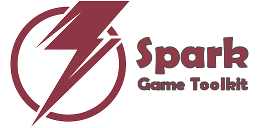

[](https://discord.gg/tPWjMwK) [](https://twitter.com/tinyBigGAMES)
# Spark Game Toolkit
### The easy, fast and fun 2D game development framework!

Allows you make games and other multimedia applications in Object Pascal.

### Overview
The Spark Game Toolkit&trade; (SGT) represents a premier independent toolkit tailored for the creation of 2D games utilizing <a href="https://www.embarcadero.com/products/delphi" target="_blank">Embarcadero Delphi®</a>, optimized for desktop PCs operating on Microsoft Windows® and leveraging OpenGL® for enhanced hardware-accelerated rendering.

Crafted for robust performance and user-friendly operation, SGT is versatile enough to facilitate the development of a wide array of 2D gaming genres and graphical simulations. It offers a straightforward and intuitive API, enabling rapid and efficient project development. The toolkit encompasses comprehensive support for textures, audio sampling, music streaming, video playback, and the capability to load resources seamlessly from compressed and encrypted archives, among other features. With SGT, the experience of game development is streamlined, swift, and enjoyable.

<b>*Please star this repo by clicking the Star box in the top right corner and tell others about it and consider <a href="https://github.com/sponsors/tinyBigGAMES" target="_blank">sponsoring this project</a> if you find it useful!*</b>

if you wish to learn more about the Delphi language visit <a href="https://learndelphi.org/" target="_blank">learndelphi.org</a>.

### Features
SGT offers an extensive suite of features:
- It is distributed freely as an open-source solution, under the permissive <a href="https://github.com/tinyBigGAMES/SparkGameToolkit/blob/main/LICENSE" target="_blank">BSD 3-Clause</a> License.
- The toolkit is developed in Object Pascal, ensuring a high level of performance and reliability.
- Exclusively supports the Windows 64-bit platform, providing a focused and optimized development environment.
- Incorporates hardware acceleration through OpenGL, ensuring optimal rendering performance.
- Facilitates interaction with a comprehensive set of classes and routines encapsulated within the SGT units.
- Features an archive system compatible with standard ZIP format, including support for password protection.
- Provides a windowing system with OpenGL 2.x support, vertical synchronization, and primitive shapes.
- Offers a texture management system, supporting a variety of image formats (JPG, PNG, TGA, GIF, etc.), with capabilities such as color key transparency, scaling, rotation, and tiling.
- Includes input handling for keyboards, mice, and game controllers.
- Video support encompasses playback controls and compatibility with MPEG-1 format.
- Audio functionalities include sample playback, streaming capabilities, and support for MP3, WAV, FLAC, OGG Vorbis formats.
- Font rendering is efficient, with true type font support and glyph caching.
- A math library is available for points, vectors, rectangles, and other utilities essential for 2D graphics.
- Streams for memory, files, and zip archives allow for resource loading from any valid stream source.
- Implements buffer management, including a virtual memory buffer and ring-buffer.
- Features a precise timer system for event management, with deterministic operations to start, stop, and check elapsed time.
- Console utilities for outputting to and interacting with the application console are provided.
- Standalone ZIP Compression tool (`ZipArc.exe`)
- Tools for converting video/audio to SGT compatible formats (`_ConvertVideo.bat/_ConvertAudio.bat`)

### Minimum Requirements 
- Should work on Windows 10+ (64 bits)
- Should work on any Delphi version that support generics and can target Win64/Unicode

**NOTE: Made/tested in/on Delphi 12/Windows 11**

### How to use in Delphi
- Please extract the contents of the archive to your preferred directory.
- Incorporate the `installdir\src` directory into Delphi’s library path to ensure the library's source files are discoverable for any project. For project-specific access, append the same to the project's search path.
- Proceed to open `SparkGameToolkit.groupproj` in Delphi to compile and execute the examples, demonstrations, and tools. This will provide a comprehensive display of the toolkit's capabilities and its application methodology.
- For further insights into utilization, refer to the samples provided within the `installdir\examples` directory. To observe the Spark Game Toolkit features in action, compile and execute the `Testbed` application. It is imperative to construct the `Data.zip` archive since it is a prerequisite for most examples. To assemble the archive, initiate `Testbed`, and navigate to `Build Zip Archive` menu option. Alternatively, click the `_BuildArc.bat` file in the `installdir\bin` folder.
- You can use `_ConvertVideo.bat` and `_ConvertAudio.bat` to convert video/audio to SGT compatible formats. You can call them like such: `_ConvertVideo.bat "source.[mp4]" "dest.MPG"` or `_ConvertVideo.bat "source.[mp4]" "dest.OGG"`. The source file can be any format supported by **ffmpeg**. See `ffmpeg.txt` in `installdir\bin` for details.
- You **MUST** include `SGT.dll` with your projects. It's just a dependency DLL, containing compiled 3rd party open-source C libraries used to make the toolkit. See <a href="THIRDPARTY.md" target="_blank">THIRDPARTY.md</a> for details.

### Minimal Example
```Pascal
var
  LWindow: TWindow;
  LFont: TFont;
  LPos: TPoint;
begin
  LWindow := TWindow.Init('SGT: Window');

  LFont := TFont.LoadDefault(LWindow, 10);

  while not LWindow.ShouldClose() do
  begin
    LWindow.StartFrame();

      if Lwindow.GetKey(KEY_ESCAPE, isWasPressed) then
        LWindow.SetShouldClose(True);

      LWindow.StartDrawing();

      LWindow.Clear(DARKSLATEBROWN);

      LPos := Math.Point(3, 3);
      LFont.DrawText(LWindow, LPos.X, LPos.Y, 0, WHITE, haLeft, 'fps %d',
        [FrameLimitTimer.FrameRate()]);
      LFont.DrawText(LWindow, LPos.X, LPos.Y, 0, GREEN, haLeft, 
        Utils.HudTextItem( 'Quit', 'ESC'), [FrameLimitTimer.FrameRate()]);

      LWindow.EndDrawing();

    LWindow.EndFrame();
  end;

  LFont.Free();
  LWindow.Free();
end.
```

### Media

### Support
Our development motto: 
- We will not release products that are buggy, incomplete, adding new features over not fixing underlying issues.
- We will strive to fix issues found with our products in a timely manner.
- We will maintain an attitude of quality over quantity for our products.
- We will establish a great rapport with users/customers, with communication, transparency and respect, always encouragingng feedback to help shape the direction of our products.
- We will be decent, fair, remain humble and committed to the craft.

### Links
- <a href="https://github.com/tinyBigGAMES/SparkGameToolkit/issues" target="_blank">Issues</a>
- <a href="https://github.com/tinyBigGAMES/SparkGameToolkit/discussions" target="_blank">Discussions</a>
- <a href="https://learndelphi.org/" target="_blank">learndelphi.org</a>

<p align="center">
  
  <br>
  Proud to be an <strong>Embarcadero Technical Partner</strong>.
</p>
<sub>As an Embarcadero Technical Partner, I'm committed to providing high-quality Delphi components and tools that enhance developer productivity and harness the power of Embarcadero's developer tools.</sub>


